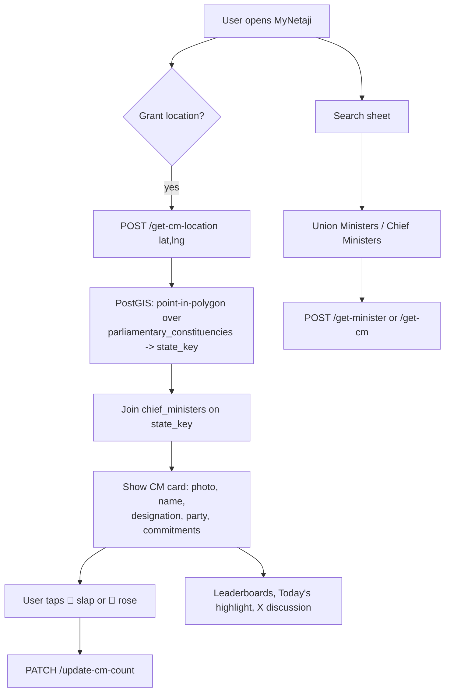

# MyNetaji

**MyNetaji** is a civic-accountability web app for India. It answers a simple question — *"who represents me, and what do I think of them?"* — by locating a user's Chief Minister from their GPS position, surfacing that leader's record, and letting anyone register a lightweight public verdict on any Chief Minister or Union Minister: a **slap** (👋, disapproval) or a **rose** (🌹, approval).

> "Neta" (नेता) is Hindi for *leader*. MyNetaji puts your leaders in front of you and turns your opinion into a tap.

---

## Table of contents

- [What MyNetaji does](#what-mynetaji-does)
- [How it works](#how-it-works)
- [The verdict mechanic](#the-verdict-mechanic)
- [Tech stack](#tech-stack)
- [Architecture](#architecture)
- [Data model](#data-model)
- [API reference](#api-reference)
- [Project structure](#project-structure)
- [Getting started](#getting-started)
- [Data pipeline](#data-pipeline)
- [Operational notes & gotchas](#operational-notes--gotchas)
- [Data provenance & disclaimer](#data-provenance--disclaimer)

---

## What MyNetaji does

- **Find your Chief Minister by location.** The browser's geolocation is resolved to a state (via a point-in-polygon lookup against constituency boundaries), and the app shows that state's sitting Chief Minister.
- **Look up any Union Minister.** A searchable directory of the Union Council of Ministers, searchable by minister name, party, or ministry/portfolio.
- **Register a verdict.** Every leader can be given a 👋 *slap* or a 🌹 *rose*. Tallies are public and update live.
- **Leaderboards.** Separate "most slapped" and "most rosed" boards for Chief Ministers and for Union Ministers, paginated.
- **Today's highlight.** Daily "most slapped / most rosed / most judged" tiles that reset at local midnight.
- **See the conversation.** An optional panel pulls recent posts about a leader from X (Twitter) via that leader's stored handle.

The app is currently built around **Chief Ministers** and **Union Ministers**. (An older Member-of-Parliament flow still exists in the backend but is no longer wired into the frontend — see [Data model](#data-model).)

---

## How it works



1. **Locate.** On the landing screen the user opts into geolocation. The coordinates are POSTed to `/get-cm-location`. The backend builds a PostGIS point and runs a `ST_Contains` query against the `parliamentary_constituencies` polygons to read off a `state_key`, then joins straight to `chief_ministers` (one CM per state, so the lookup is unambiguous). No new spatial table is needed for CMs — the existing constituency boundaries are reused purely to derive the state.
2. **Read the record.** The CM card shows the photo, name, official designation, party, and a "commitments" list (manifesto points). More detail lives in bottom sheets.
3. **Vote.** Tapping 👋 or 🌹 fires a `PATCH` that increments both the lifetime count (`slap_count`/`rose_count`) and the daily count (`slap_count_today`/`rose_count_today`).
4. **Explore.** From the same screen the user can open the Union-Minister search, the leaderboards, the "today's highlight" tiles, and the X-discussion panel for the current subject.

---

## The verdict mechanic

The two verbs are the heart of the product and are **not** the app's name — they are the interaction:

| Glyph | Action | Lifetime column | Daily column |
|------|--------|-----------------|--------------|
| 👋 | **Slap** (disapprove) | `slap_count` | `slap_count_today` |
| 🌹 | **Rose** (approve) | `rose_count` | `rose_count_today` |

Voting is intentionally frictionless: there is no login and no server-side identity or rate limit — a user can slap/rose repeatedly. This is a sentiment toy, not an election. The daily counters are cleared at every local midnight by a background task so "today's highlight" reflects only the current day.

---

## Tech stack

### Backend
- **Python 3.9**
- **FastAPI** (`0.128`) + **Uvicorn** — HTTP API
- **SQLAlchemy 2.0 Core** — tables are **reflected** from the live database at import time (`Table(..., autoload_with=engine)`); queries use Core `select`/`update`, not the ORM
- **PostgreSQL + PostGIS**, hosted on **Neon** — spatial boundaries and all political data
- **psycopg2-binary** — DB driver
- **pydantic** / **pydantic-settings** — request models and config
- **Alembic** — migrations
- **httpx** — outbound calls to the X (Twitter) API

### Frontend (`web/`)
- **Next.js 16** (App Router, Turbopack) written in **JavaScript** (no TypeScript; `jsconfig.json` provides the `@/*` alias)
- **React 19**
- **Tailwind CSS v4** (`@tailwindcss/postcss`) — design tokens in `globals.css` `@theme`
- **Framer Motion** — the vote choreography and micro-interactions
- **@tanstack/react-query v5** — data fetching, caching, infinite-scroll leaderboards
- **Axios** — HTTP client
- **lucide-react** — icons
- **Fredoka** (display) + **Nunito** (body) via `next/font`

### Data pipeline
- Standalone Python scripts under `app/data_update/` that scrape/refresh rosters, photos, and manifestos from public sources (Wikipedia/Wikimedia Commons, myneta.info, sansad.in) and boundary shapefiles.

---

## Architecture

```
                        ┌────────────────────────────┐
   Browser (Next.js) ── │  web/  (App Router, JS)     │
        │  axios        └────────────────────────────┘
        │  NEXT_PUBLIC_API_URL
        ▼
   ┌───────────────────────────────────────────────┐
   │  FastAPI  (app/main.py -> app/api/*.py routers) │
   │  • reflected SQLAlchemy Core tables             │
   │  • PostGIS point-in-polygon for location        │
   │  • daily_reset background task (lifespan)       │
   │  • X API proxy (/tweets)                        │
   └───────────────────────────────────────────────┘
        │  psycopg2 / SQLAlchemy
        ▼
   ┌───────────────────────────────────────────────┐
   │  PostgreSQL + PostGIS  (Neon)                    │
   │  chief_ministers · ministers · mps ·            │
   │  parliamentary_constituencies (geom) ·          │
   │  assembly_constituencies · party_manifesto_...  │
   └───────────────────────────────────────────────┘
        ▲
        │  batch upserts
   ┌───────────────────────────────────────────────┐
   │  app/data_update/*.py  (offline refresh jobs)   │
   └───────────────────────────────────────────────┘
```

### Backend

- **`app/main.py`** creates the FastAPI app (`title="MyNetaji"`), registers the error handlers and CORS (in that order — see gotchas), includes every router from `app/api/`, and owns a **lifespan** that starts `app/tasks/daily_reset.py`.
- **`app/api/`** holds one `APIRouter` per domain — `mps.py`, `chief_ministers.py`, `ministers.py`, `highlights.py`, `politicians.py`, `performance.py`, `feeds.py`, `feedback.py` — each tagged so `/docs` groups them. Two shared modules sit underneath: `tables.py` reflects the externally-owned tables once for the whole process, and `localisation.py` holds the English/Hindi column helpers.
- Tables are reflected **once at module import** (not per-request) — reflecting these against Neon costs ~20s, so hoisting it keeps request latency low. Location endpoints construct a PostGIS point and use `ST_Contains` against the GIST-indexed `geom` column.
- **`app/tasks/daily_reset.py`** is an asyncio loop that, at every local midnight, zeroes the `*_today` counters. It uses a Postgres **advisory lock** (`pg_try_advisory_xact_lock`) so multiple workers don't double-reset, plus a `daily_counter_resets` bookkeeping row to catch up on a boundary missed while the service was down.
- **`app/db/connect.py`** builds the engine from `DB_URL` and exposes a `get_db` session dependency.
- **`app/config/settings.py`** loads `app/.env` via pydantic-settings (`DB_URL`, `BEARER_TOKEN_X`, `CORS_ORIGINS`).

### Frontend

Feature-oriented App Router layout under `web/src/`:

- **`app/`** — `layout.jsx` (fonts + metadata), `page.jsx` (static server shell) → `home.jsx` (the client app), `providers.jsx` (React Query), `globals.css` (Tailwind v4 theme tokens).
- **`components/`** — `RepresentativeCard`, `VoteButtons`, `SearchSheet` + `CmCombobox`/`MinistryCombobox`, `Leaderboard`/`LeaderboardSheet`, `InfoSheet`, `TodaysHighlight`, `StatusScreens`, `Landing`, the `vote/` choreography (`VotePortrait`/`VoteFlight`/`VoteAnnouncement`), and the `x/` discussion panel.
- **`hooks/`** — `useChiefMinisters`, `useMinistries`, `useLeaderboard` (infinite query), `useHighlights`, `useTweets`, `useVote`, `useVoteChoreography`.
- **`lib/`** — `api.js` (Axios instance + endpoint wrappers), `chiefMinisters.js` / `ministries.js` (client-side search + portfolio parsing), `manifesto.js`, `geolocation.js`.

State/navigation is driven by plain React + React Query (no router library beyond Next). Photos render with a plain `` because sources span `upload.wikimedia.org`, `myneta.info`, and `sansad.in`.

---

## Data model

Live PostgreSQL/PostGIS tables (hosted on Neon):

| Table | Rows (approx.) | Used by frontend? | Purpose |
|-------|----------------|-------------------|---------|
| `chief_ministers` | 31 | ✅ | One CM per state/UT. Cols: `id, name, state, state_key, party, designation, photo_url, slap_count, rose_count, slap_count_today, rose_count_today, manifesto_points[], x_username`. |
| `ministers` | ~85 | ✅ | Union Council of Ministers. Cols: `id, ministry, minister_name, party, photo_url, slap_count, rose_count, slap_count_today, rose_count_today, manifesto_points[], x_username`. `ministry` is a **semicolon-joined portfolio string** — one person can span multiple rows/portfolios. |
| `party_manifesto_points` | — | ✅ | Party → array of manifesto `points` (joined into CM/MP responses by party). |
| `parliamentary_constituencies` | 543 | ✅ (spatial only) | PostGIS `geom` polygons; used to resolve a location to a `state_key`. |
| `assembly_constituencies` | ~4,123 | ⚪ kept, unused | Assembly boundaries; retained from the earlier MLA feature. |
| `mps` | 543 | ⚪ kept, unused | MP roster; MP endpoints still exist but the frontend no longer calls them. |

> **Naming note:** `slap_count` / `rose_count` are the **voting mechanic**, not the brand — they are intentionally left as-is. The app name ("MyNetaji") lives only in UI copy and metadata; it does not appear in the schema. (The offline data pipeline still sends a legacy `myNeta-DataPipeline` User-Agent.)

---

## API reference

Base URL: `http://localhost:8000` in development (frontend reads `NEXT_PUBLIC_API_URL`).

### Chief Ministers (live)
| Method | Path | Notes |
|--------|------|-------|
| POST | `/get-cm-location` | `{latitude, longitude}` → the CM for that location. |
| POST | `/get-cm` | Omit `state_key` for the full 31-row list; pass it for one CM. |
| GET  | `/get-leaderboard-cm` | `?limit=&offset=` → `{slap_toppers, rose_toppers}`. |
| PATCH| `/update-cm-count` | `{state_key, name, field_to_update}` — increments a slap/rose counter. |

### Union Ministers (live)
| Method | Path | Notes |
|--------|------|-------|
| POST | `/get-minister` | Omit `name` for the whole council; pass it for one minister. |
| POST | `/get-ministers-by-name` | Fetch by `(name, ministry)`. |
| GET  | `/get-leaderboard-minister` | `?limit=&offset=`. |
| PATCH| `/update-ministry-count` | `{ministry_name, name, field_to_update}`. Send the row's **full original** `ministry` string. |

### Cross-tier (live)
| Method | Path | Notes |
|--------|------|-------|
| GET | `/most-slapped` · `/most-roasted` · `/most-judged` | Today's highlight across CMs + ministers. |
| POST | `/tweets` | `{table, name}` → recent X posts for that leader's stored handle. |

### Legacy MP endpoints (present, not used by the frontend)
`POST /get-location`, `POST /get-mps-by-name`, `GET /get-leaderboard-mp`, `PATCH /update-member-count`.

---

## Project structure

```
SYL/                         # repository root (directory name unchanged)
├── app/                     # FastAPI backend
│   ├── main.py              # app factory, error handlers, CORS, lifespan, routers
│   ├── api/                 # one APIRouter per domain + shared tables/localisation
│   ├── db/connect.py        # engine + session
│   ├── config/settings.py   # pydantic-settings (reads app/.env)
│   ├── model/               # ORM base classes (declarative)
│   ├── tasks/daily_reset.py # midnight counter reset
│   └── data_update/         # offline data-refresh scripts
├── alembic/ , alembic.ini   # migrations
├── boundaries/              # source GeoJSON for constituency polygons
├── web/                     # Next.js frontend
│   └── src/{app,components,hooks,lib}
├── requirements.txt
└── README.md
```

---

## Getting started

### Prerequisites
- Python 3.9 and a virtualenv (repo uses `.venv/`)
- Node.js 18+ (Next.js 16)
- Access to a PostgreSQL database with the **PostGIS** extension (the project uses Neon)

### 1. Backend

```bash
# from the SYL/ root
python3 -m venv .venv
.venv/bin/pip install -r requirements.txt
```

Create `app/.env`:

```
DB_URL=postgresql://<user>:<password>@<host>/<db>
BEARER_TOKEN_X=<x-api-bearer-token>       # only needed for the /tweets panel
CORS_ORIGINS=http://localhost:3000        # comma-separated allowed frontend origins; add the deployed URL in production
```

Run the API (from the `SYL/` root so `app/.env` resolves):

```bash
.venv/bin/python -m uvicorn app.main:app --reload --port 8000
```

> Startup pays a one-time ~20–30s cost while SQLAlchemy reflects the tables against Neon. Requests are fast once it's up.

### 2. Frontend

```bash
cd web
npm install
# point at the backend (defaults to http://localhost:8000)
echo 'NEXT_PUBLIC_API_URL=http://localhost:8000' > .env.local
npm run dev
```

Open http://localhost:3000. Geolocation requires `https://` or `localhost` and the browser's permission prompt.

---

## Data pipeline

Offline scripts in `app/data_update/` keep the political data current. They send a `myNeta-DataPipeline/1.0` User-Agent and batch-upsert into the live DB.

| Script | Refreshes |
|--------|-----------|
| `chief_minister_update.py` | CM roster (name/state/party/designation/photo). |
| `chief_minister_manifesto_update.py` | CM manifesto points. |
| `minister_update.py` | Union Council roster + portfolios. |
| `minister_manifesto_enrich.py` | Union Minister manifesto points (keyed by name). |
| `photo_update.py` / `myneta_photo_update.py` / `sansad_photo_update.py` | Photos from Wikimedia / MyNeta / sansad.in. |
| `manifesto_update.py` | Party manifesto points. |
| `update_boundries.py` | Constituency boundary shapefile import. |
| `roster_reconcile.py` / `roster_refresh.py` / `mp_roster_refresh.py` | Roster reconciliation vs. official sources. |

Run them from the `SYL/` root with the package path available, e.g.:

```bash
PYTHONPATH=app .venv/bin/python -m data_update.chief_minister_update
```

---

## Operational notes & gotchas

- **Table reflection is module-scoped.** Never move `Table(..., autoload_with=engine)` inside a request handler — reflecting against Neon costs ~20s and would make every request time out. Schema changes require a server restart to be picked up.
- **Error handlers are registered before `CORSMiddleware`, and the catch-all is a middleware, not `@app.exception_handler(Exception)`.** Starlette runs that handler in `ServerErrorMiddleware`, outside the CORS layer, so its 500 goes out with no `Access-Control-Allow-Origin` and the browser reports a CORS failure instead of the server's message. `add_middleware` inserts at the front of the stack, so CORS must be added *last* to end up outermost.
- **Location endpoints are POST**, not GET: browsers strip the body from GET (XHR spec), which made the location lookup uncallable from the web client.
- **Ministry voting must send the row's full original `ministry` string** — the update handler matches it exactly, and one row can hold several semicolon-joined portfolios.
- **Photos use `referrerPolicy="no-referrer"`** because `myneta.info` and `sansad.in` hotlink-block on Referer.
- **No auth / no rate limit** on votes by design; treat tallies as sentiment, not data.

---

## Data provenance & disclaimer

Political data (names, parties, portfolios, photos) is compiled from public sources — Wikipedia/Wikimedia Commons, [myneta.info](https://myneta.info) (ADR), and official government sites. Photos are hotlinked from Wikimedia Commons. MyNetaji is an independent civic-sentiment project and is not affiliated with any government body, political party, or the myneta.info platform. Verdicts (👋/🌹) are anonymous, unverified public sentiment and are not a poll, survey, or measure of electoral opinion.
